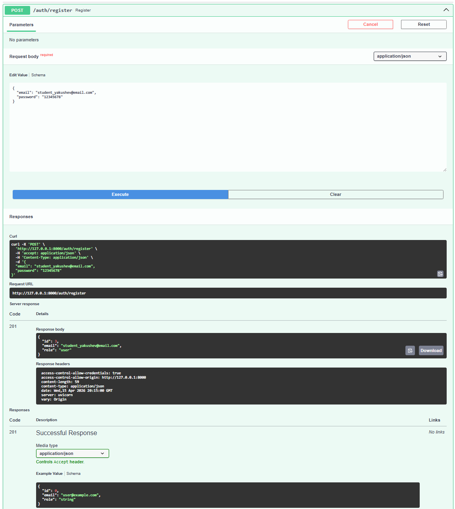
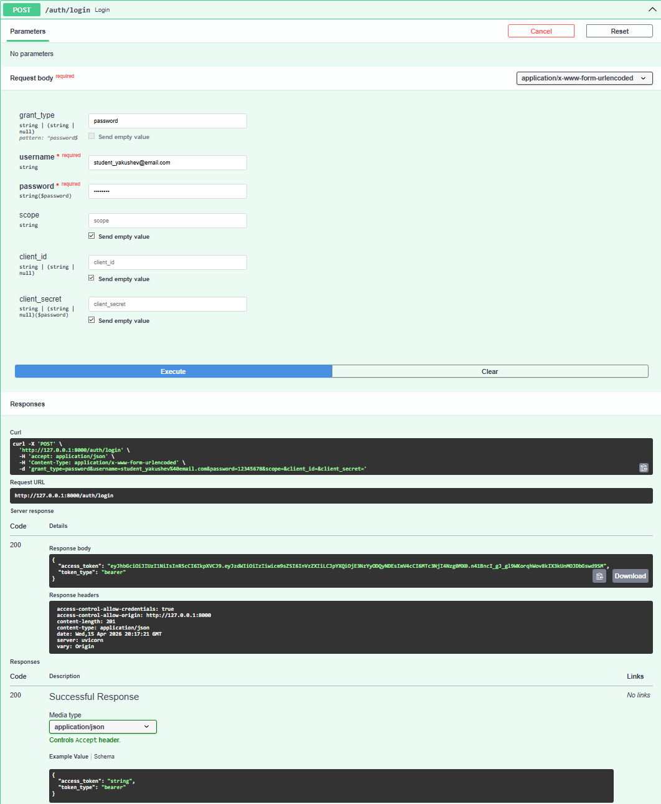
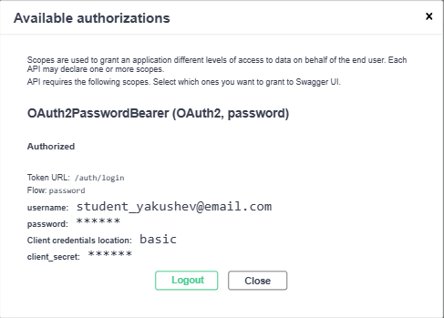
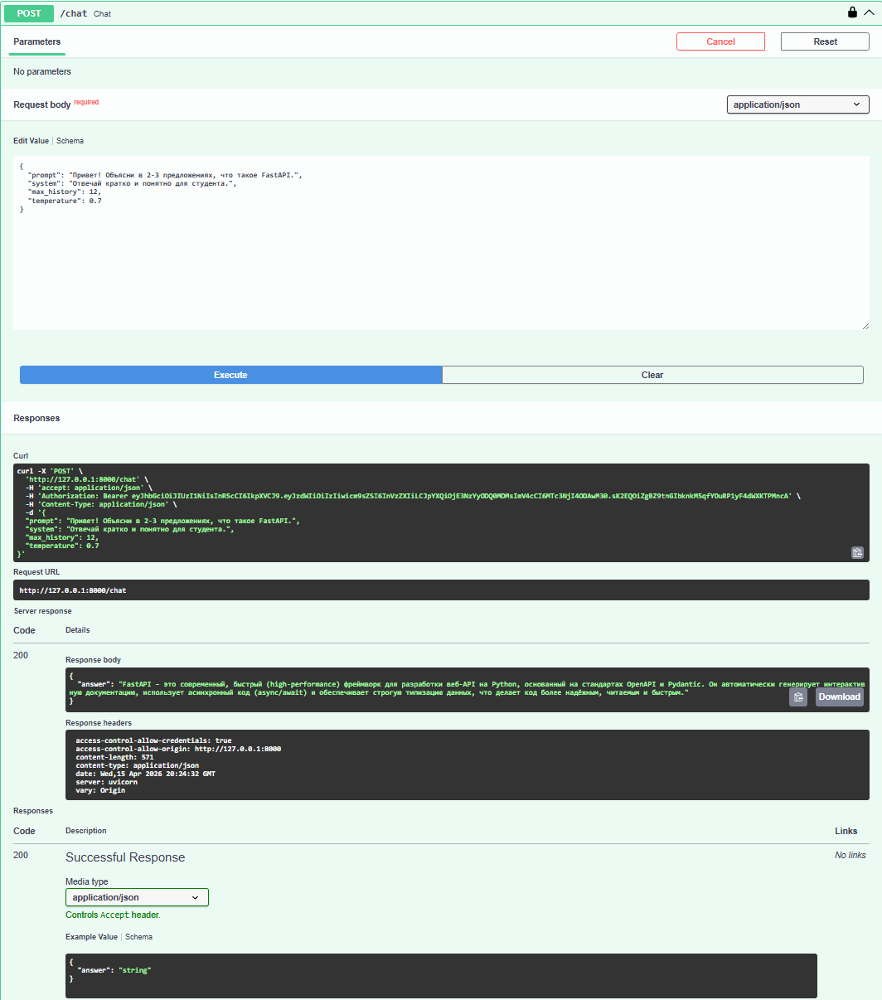
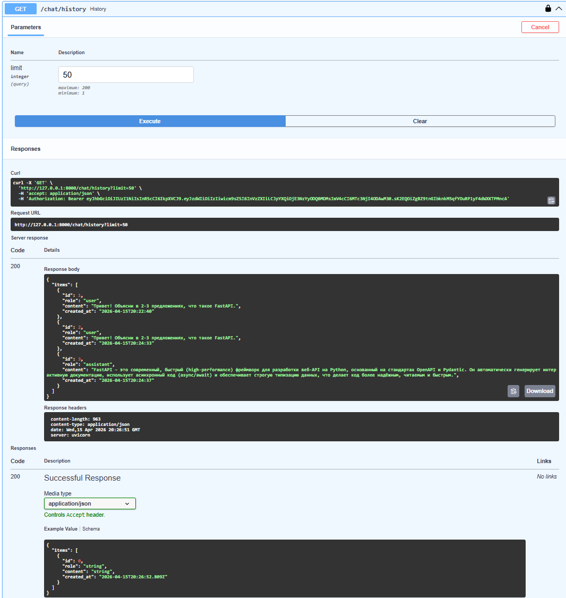
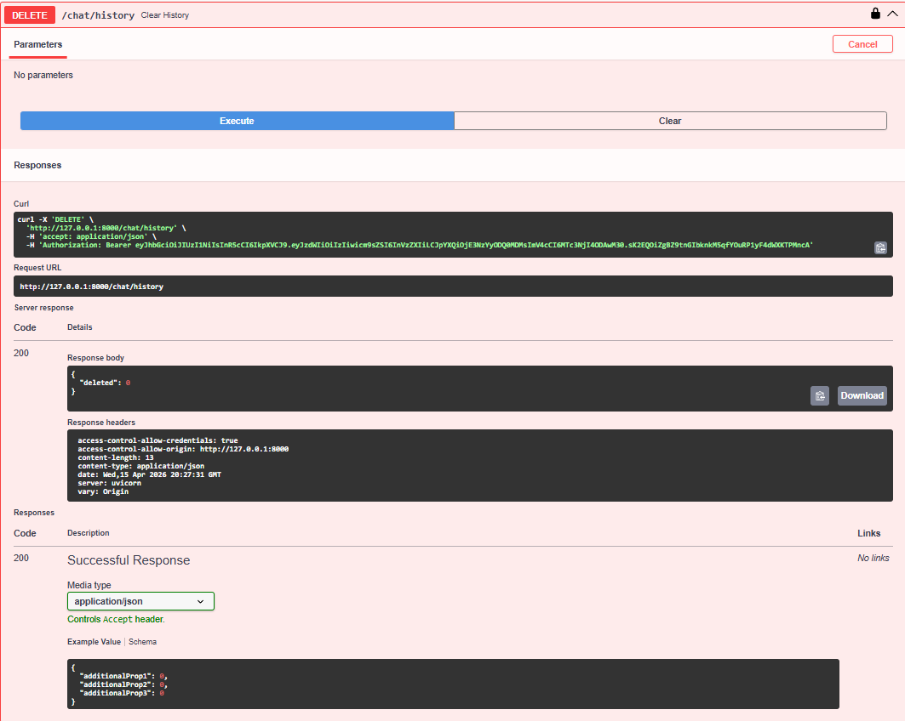
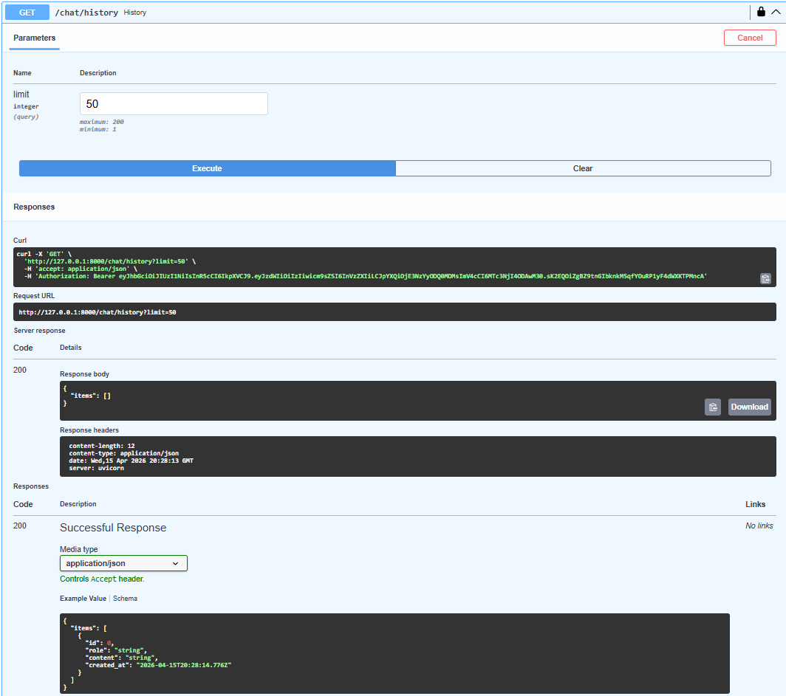

# llm-p

FastAPI service with JWT auth, SQLite, and OpenRouter LLM integration.

## Installation and run with uv

### 1. Install `uv`

```bash
pip install uv
```

### 2. Open the project directory

```powershell
cd E:\projects\PythonAPI
```

### 3. Create a virtual environment

```bash
uv venv
```

### 4. Activate the virtual environment

```powershell
.venv\Scripts\Activate.ps1
```

For MacOS/Linux:

```bash
source .venv/bin/activate
```

### 5. Install dependencies

For Windows PowerShell:

```powershell
uv pip compile pyproject.toml -o requirements.lock
uv pip install -r requirements.lock
```

For MacOS/Linux:

```bash
uv pip install -r <(uv pip compile pyproject.toml)
```

## Environment variables

Create `.env` from `.env.example`:

```powershell
Copy-Item .env.example .env
```

Set your OpenRouter API key in `.env`:

```env
APP_NAME=llm-p
ENV=local

JWT_SECRET=change_me_super_secret
JWT_ALG=HS256
ACCESS_TOKEN_EXPIRE_MINUTES=60

SQLITE_PATH=./app.db

OPENROUTER_API_KEY=your_openrouter_api_key
OPENROUTER_BASE_URL=https://openrouter.ai/api/v1
OPENROUTER_MODEL=stepfun/step-3.5-flash:free
OPENROUTER_SITE_URL=https://example.com
OPENROUTER_APP_NAME=llm-fastapi-openrouter
```

If `stepfun/step-3.5-flash:free` is unavailable in OpenRouter at the time of testing, use:

```env
OPENROUTER_MODEL=openrouter/free
```

## Run the application

```bash
uv run uvicorn app.main:app --reload
```

Available URLs after startup:

- Swagger UI: [http://127.0.0.1:8000/docs](http://127.0.0.1:8000/docs)
- Health check: [http://127.0.0.1:8000/health](http://127.0.0.1:8000/health)

## Code quality check

```bash
uv run ruff check .
```

## API test order

After the server starts, test the API in this order:

1. `POST /auth/register`
2. `POST /auth/login`
3. `Authorize` in Swagger
4. `POST /chat`
5. `GET /chat/history`
6. `DELETE /chat/history`

For registration use an email in this format:

```text
student_surname@email.com
```

## Screenshots

The README must contain screenshots of:

1. User registration
2. Login and JWT token
3. Swagger authorization
4. `POST /chat`
5. `GET /chat/history`
6. `DELETE /chat/history`

Screenshot folder:

```text
docs/screenshots/
```

Used file names:

```text
docs/screenshots/register.png
docs/screenshots/login.png
docs/screenshots/authorize.png
docs/screenshots/chat.png
docs/screenshots/history.png
docs/screenshots/clear_history.png
```

## API screenshots

### Registration


### Login


### Swagger Authorize


### Chat request


### Chat history


### Clear history


### Extra: history after clear

